# SDL2 图形算法实验集

基于 **SDL2** 的图形 / 数学 / 音频算法实验合集，每个示例是独立可运行的项目。
 

## 📦 环境要求

| 项 | 版本 |
|---|---|
| CMake | ≥ 3.17 |
| Visual Studio | 2017 / 2019 / 2022 |
| SDL2 | 2.0.20（已内置 `third_party/SDL2/`） |

---

## 🔨 构建

```bash
# x64
cmake -S . -B proj.win32 -G "Visual Studio 17 2022" -A x64

# x86
cmake -S . -B proj.win32 -G "Visual Studio 17 2022" -A Win32
```

打开 `proj.win32/sdl_example.sln`，右键任意项目 → **设为启动项目** → **F5**。

---

## 🎨 示例一览

### 001 · 2D 顶点旋转

顶点坐标的旋转 / 缩放 / 平移，手动矩阵计算。

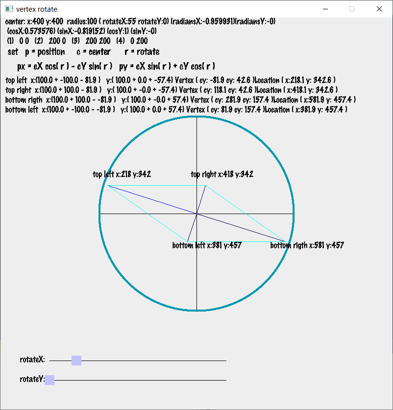

---

### 002 · 2D 射线

射线与线段的交点计算、射线与矩形碰撞检测。

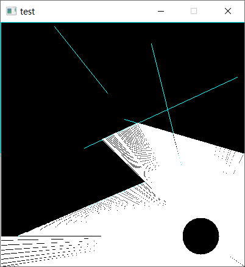

---

### 003 · N 阶贝塞尔曲线

任意阶数的贝塞尔曲线采样与绘制（德卡斯特里奥 / 伯恩斯坦）。

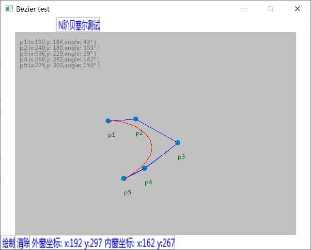

---

### 004 · 像素级实例化

按像素遍历生成图形，逐像素绘制。

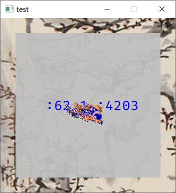

---

### 005 · Surface 移动透明

`SDL_Surface` 层的移动与 alpha 混合。

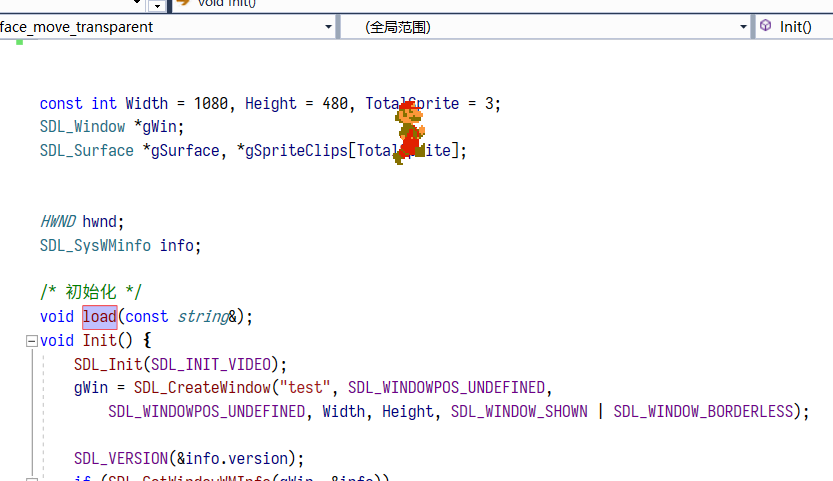

---

### 006 · Renderer 移动透明

`SDL_Renderer` 层的移动与混合模式对比。

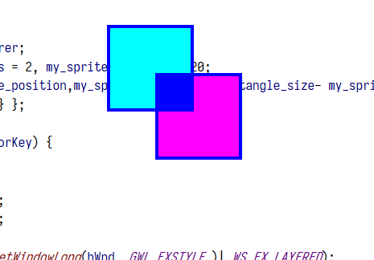

---

### 007 · 菜单

SDL2 简易菜单 / UI 交互示例。

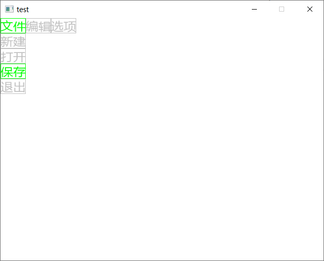

---

### 008 · 小球重力系统

重力、碰撞、反弹的物理模拟。

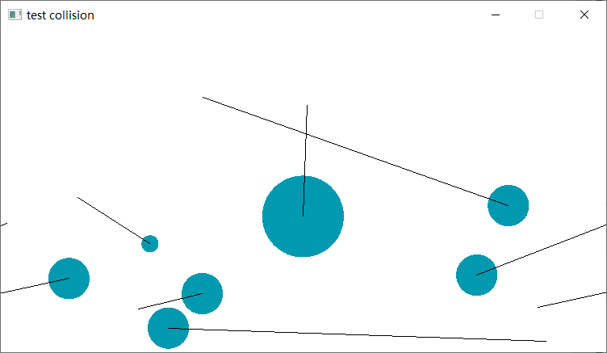

---

### 009 · 水波纹

水波扩散算法的实时模拟。

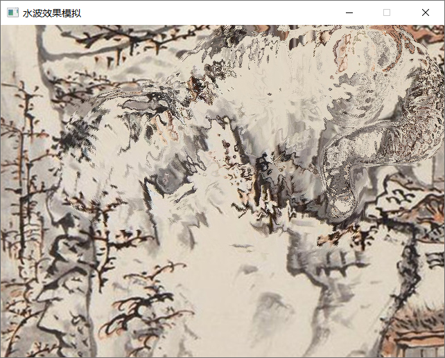

---

### 010 · 拖尾（Motion Streak）

仿 2DX `MotionStreak` 的拖尾效果，Catmull-Rom 加密 + Miter 法线。

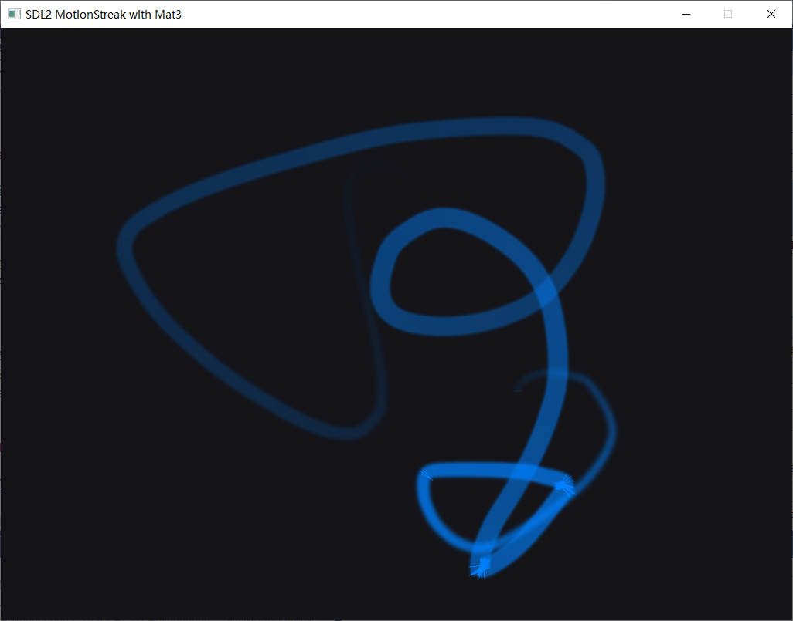

---

### 011 · 2D 矩阵与顶点

`Mat3` 矩阵与顶点变换的综合演示。

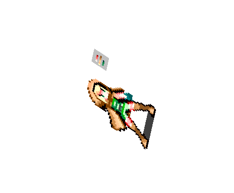

---

### 012 · 正弦矩阵波

正弦波驱动顶点变形的网格动画。

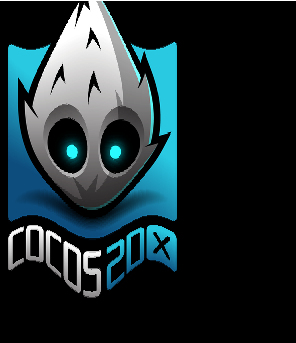

---

### 013 · 音频变调

`SDL_mixer` 播放音频时的实时变调。
 

---

### 014 · 声波可视化

读取音频数据并绘制波形。
 

---

## 📁 目录结构

```
sdl_example/
├── CMakeLists.txt                # 顶层构建
├── examples/                     # 14 个独立示例
│   ├── 001_2d_vertex_rotation/
│   ├── 002_2d_ray/
│   ├── 003_n_order_bezier/
│   ├── 004_pixel_instantiation/
│   ├── 005_surface_move_transparent/
│   ├── 006_renderer_move_transparent/
│   ├── 007_menu/
│   ├── 008_small_ball_gravity_system/
│   ├── 009_water_ripple/
│   ├── 010_motion_streak/
│   ├── 011_2d_matrix_and_vertex/
│   ├── 012_sine_matrix_wave/
│   ├── 013_sound_pitching_example/
│   ├── 014_sound_wave/
│   └── common/                   # 公共头
├── Resources/                    # 共享资源
├── screenshots/                  # README 截图
├── third_party/SDL2/             # 预编译 SDL2
└── proj.win32/                   # 生成物（gitignore）
```

---

## 🧩 关键设计

- **每个示例独立构建**：`examples/00X/` 是完整项目，可单独 `cmake -S examples/00X -B build`
- **自动扫描源文件**：`src/` 或平级目录下所有 `.cpp/.h` 自动加入编译
- **共享 SDL2**：`third_party/SDL2/` 一份，所有示例共用
- **资源自动镜像**：顶层 `SyncRes` target 每次构建自动同步 `Resources/` 到输出目录
- **x64 / x86 自适应**：CMake 自动按平台选 lib

---

## 📄 License

MIT
